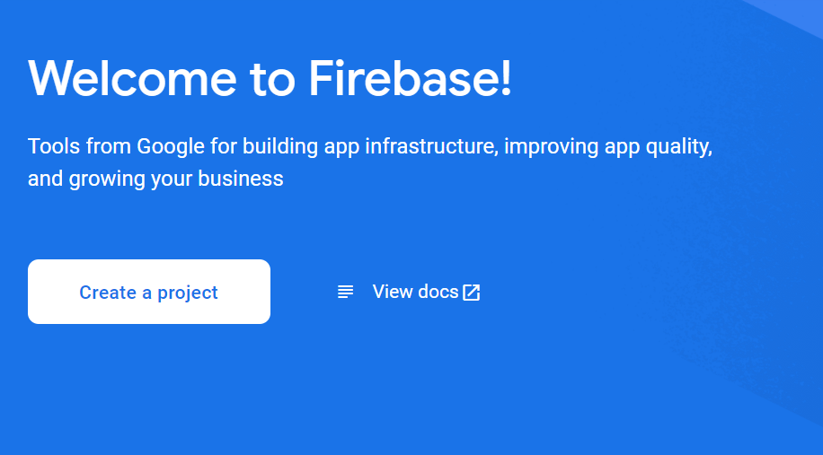
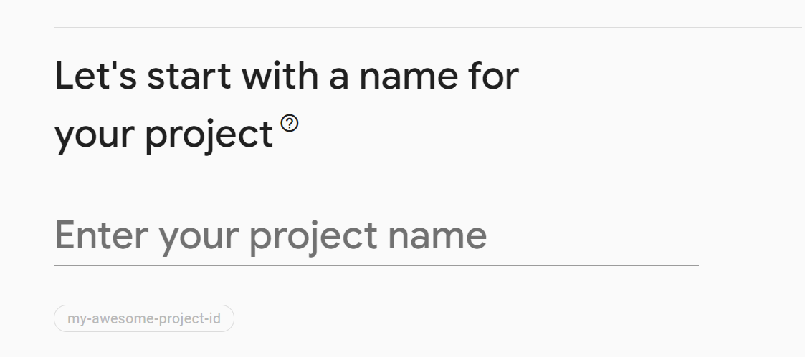
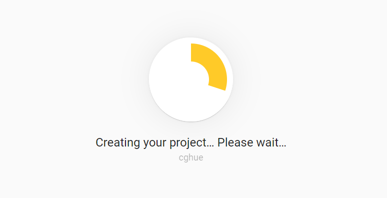
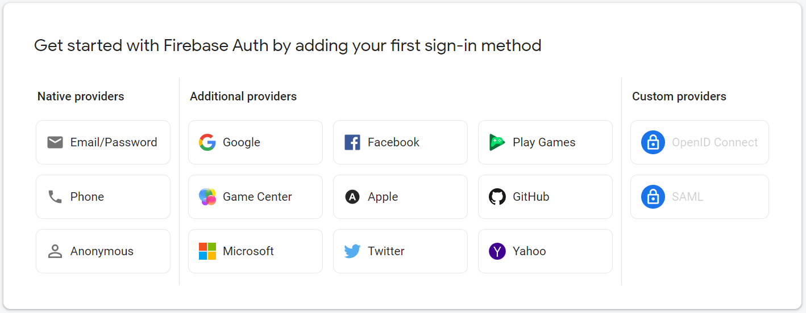
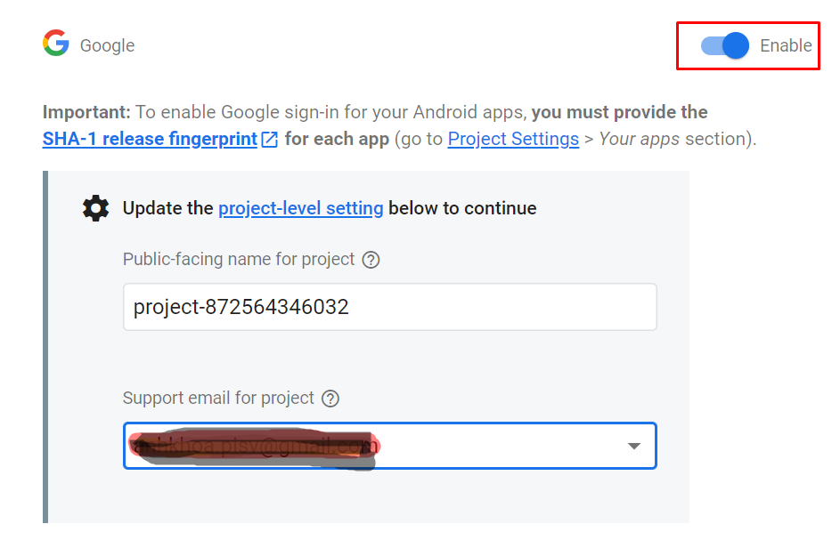
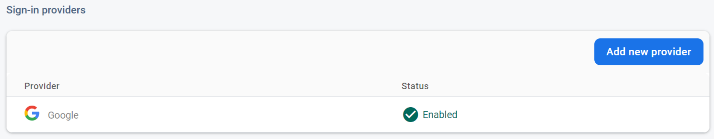
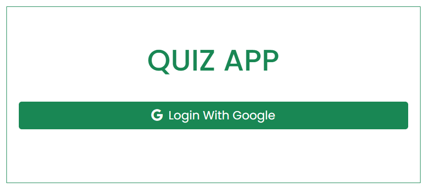
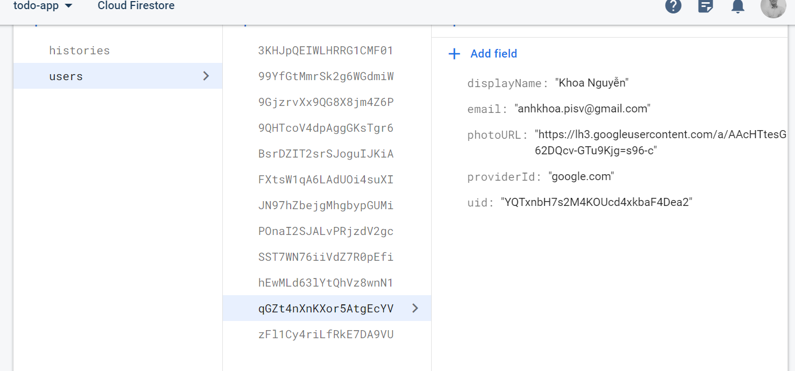

<h1>LÀM THẾ NÀO ĐỂ SỬ DỤNG FIREBASE TRONG DỰ ÁN REACTJS</h1>

<h2>Mục lục</h2>

<ul style='list-style:none;'>
    <li style='font-style:italic;'>Mở đầu</li>
    <li style='font-style:italic;'>Nội dung
        <ol>
            <li style='font-style:italic;'><a href='#fb_1'>Firebase là gì?</a></li>
            <li style='font-style:italic;'><a href='#fb_2'>Các thành phần chính của Firebase</a></li>
            <li style='font-style:italic;'><a href='#fb_3'>Hướng dẫn tạo tài khoản Firebase</a></li>
            <li style='font-style:italic;'><a href='#fb_4'>Hướng dẫn tích hợp Firebase vào dự án ReactJS</a></li>
            <li style='font-style:italic;'><a href='#fb_5'>Kết luận</a></li>
        </ol>
    </li>
</ul>


<h2>Mở đầu</h2>

Một trong những vấn đề khi chúng ta học ReactJS đó là làm thế nào để kết nối với CSDL. Thông thường chúng ta sẽ sử dụng fake API hoặc xịn hơn nữa thì chúng ta có thể build một API để phục vụ cho bài toán của mình.
Việc làm này sẽ mất khá nhiều thời gian, và đòi hỏi chúng ta phải có kiến thức về Backend hoặc các ngôn ngữ như C#, Java, PHP hay NodeJS,...
Liệu có cách nào để chúng ta build ra được 1 ứng dụng ReactJS mà chưa có nhiều kiến thức về Backend hay không? câu trả lời là có và một trong những giải pháp đó là chúng ta sử dụng firebase.

<h2>Nội dung</h2>

<h3 id='fb_1' class='font-weight: bolder'>1. Firebase là gì?</h3>

>Firebase là một nền tảng để phát triển ứng dụng di động hay website, bao gồm các API đơn giản và mạnh mẽ mà không cần backend hay server

Lợi ích của Firebase là gì? Firebase còn giúp các lập trình viên rút ngắn thời gian triển khai và mở rộng quy mô của ứng dụng mà họ đang phát triển.

Firebase là dịch vụ cơ sở dữ liệu hoạt động trên nền tảng đám mây – cloud. Kèm theo đó là hệ thống máy chủ cực kỳ mạnh mẽ của Google. Chức năng chính là giúp người dùng lập trình ứng dụng bằng cách đơn giản hóa các thao tác với cơ sở dữ liệu.

<h3 id='fb_2' class='font-weight: bolder'>2. Các thành phần chính của Firebase</h3>

<h4>a. Firebase Authentication</h4>
Hoạt động nổi bật của Firebase là xây dựng các bước xác thực người dùng bằng Email, Facebook, Twitter, GitHub, Google. Đồng thời cũng xác thực nặc danh cho các ứng dụng. Hoạt động xác thực có thể giúp thông tin cá nhân của người sử dụng được an toàn và đảm bảo không bị đánh cắp tài khoản.

<h4>b. FireStore Database</h4>

Khi đăng ký một tài khoản trên Firebase để tạo ứng dụng, bạn đã có một cơ sở dữ liệu thời gian thực. Dữ liệu bạn nhận được dưới dạng JSON. Đồng thời nó cũng luôn được đồng bộ thời gian thực đến mọi kết nối client.

<h3 id='fb_3' class='font-weight: bolder'>3. Hướng dẫn tạo tài khoản Firebase</h3>

<h4>Bước 1</h4>

Truy cập vào địa chỉ [firebase.com](https://firebase.google.com/) để tạo tài khoản và sau đó vào chức năng `Console`.

<h4>Bước 2</h4>

Tại màn hình này bấn vào nút `Create a project`



Nhập tên dự án của bạn ở màn hình sau, và check vào checkbox chấp nhận điều khoản của Firebase. Sau đó tiếp tục nhấn next



Chờ một lúc cho đến khi Firebase tạo xong dự án của bạn



<h4>Bước 3</h4>

Để lấy các thông tin cấu hình khi tích hợp Firebase vào dự án của bạn, tại màn hình sau bạn click vào biểu tượng `</>` web. sau đó bạn thực hiện các thao tác tiếp theo để hoàn thành việc đăng ký ứng dụng của bạn với Firebase.


Sau khi hoàn thành thì bên dưới là những hướng dẫn để tích hợp Firebase vào dự án.
Sử dụng npm để cài đặc firebase

> npm install firebase

Thông tin cấu hình của Firebase

```js
import { initializeApp } from "firebase/app";
import { getAnalytics } from "firebase/analytics";

// Your web app's Firebase configuration
// For Firebase JS SDK v7.20.0 and later, measurementId is optional
const firebaseConfig = {
  apiKey: "XXXXXXXXXXXXXXXXXXXXXXXXXXXXXXXX",
  authDomain: "XXXXXXXXXXXXXXXXXXXXXXXXXXXXXXXX",
  projectId: "XXXXXXXXXXXXXX",
  storageBucket: "XXXXXXXXXXXXXXXXXXXXXXXXXXXXX",
  messagingSenderId: "XXXXXXXX",
  appId: "XXXXXXXXXXXXXXXXXXXXXXXXXXXXXXXXXXXXX",
  measurementId: "XXXXXXXXX"
};

// Initialize Firebase
const app = initializeApp(firebaseConfig);
const analytics = getAnalytics(app);
```

<h4>Bước 4</h4>

Thiết lập đăng nhập với bên thứ 3 (ví dụ như sử dung google). Trả lại mà hình `Console` bạn chọn vào chức năng `Authentication` ở menu bên trái. Tiếp theo bấm vào nút `Get Start`. sau đó chọn vào tab `Sign-in method`. Sau đó bạn chọn vào provider mà mình muốn sử dụng (bạn có thể chọn nhiều Provider khác nhau). Ví dụ ở đây chúng ta chọn `Google`.



Tiếp theo bạn click và nút `Enable` và điền địa chỉ email của bạn ở ô `Support email for project` và cuối cùng là click vào nút `Save`.



Nếu thành công bạn sẽ thấy được màn hình sau


<h3 id='fb_4' class='font-weight: bolder'>4. Hướng dẫn tích hợp Firebase vào dự án ReactJS</h3>

<h4>Bước 1</h4>

Tạo file `config.js` và sử dụng thông tin ở `Bước 3` trong phần 3 ở trên. Lưu ý, trong 
bài viết này mình sử dụng firebase version 12.4.7.

```js
import firebase from 'firebase/compat/app';
import 'firebase/compat/analytics';
import 'firebase/compat/auth';
import 'firebase/compat/firestore';

const firebaseConfig = {
  apiKey: "XXXXXXXXXXXXXXXXXXXXXXXXXXXXXXXX",
  authDomain: "XXXXXXXXXXXXXXXXXXXXXXXXXXXXXXXX",
  projectId: "XXXXXXXXXXXXXX",
  storageBucket: "XXXXXXXXXXXXXXXXXXXXXXXXXXXXX",
  messagingSenderId: "XXXXXXXX",
  appId: "XXXXXXXXXXXXXXXXXXXXXXXXXXXXXXXXXXXXX",
  measurementId: "XXXXXXXXX"
};

firebase.initializeApp(firebaseConfig);
firebase.analytics();
const auth = firebase.auth();
const db = firebase.firestore();

export { auth, db }
export default firebase;
```
<h4>Bước 2</h4>

Tạo form Login như hình sau 



<h4>Bước 3</h4>

Mã nguồn xử lý sự kiện khi người dùng bấm vào nú `Login With Google` như sau:
Tạo `GoogleAuthProvider`

`const googleProvider = new firebase.auth.GoogleAuthProvider();`

Nếu đăng nhập thành công thì tiến hành ghi thông tin người dùng vào `Collection` được đặt tên trong trường hợp này là `users`với các thông tin cơ bản như bên dưới.

```js
const handleGoogleLogin = async () => {
        const { additionalUserInfo, user } = await auth.signInWithPopup(googleProvider);
        if(additionalUserInfo?.isNewUser){
            await addDoc(collection(db, 'users'), {
                displayName: user.displayName,
                email: user.email,
                photoURL: user.photoURL,
                uid: user.uid,
                providerId: additionalUserInfo?.providerId
            })
        }
    }
```

<h4>Bước 5</h4>

Kiểm tra dữ liệu đã được lưu vào Firestore bằng cách, từ `Console` ở Firebase, bạn chọn chức năng `Firestore Database` ở menu bên trái sẽ thấy màn hình như sau:




<h3 id='fb_5' class='font-weight: bolder'>5. Kết luận</h3>

Mình đã làm và đây là thành quả của mình [quiz-app-cgh](https://quiz-app-cgh.vercel.app/), các bạn có thể tham khảo đầy đủ mã nguồn ở đây [quiz-app-git](https://github.com/khoanguyen84/quiz-app.git).  Hy vọng qua bài hướng dẫn này bạn sẽ biết cách để tạo tài khoản firebase và tích hợp firebase vào trong ứng dụng React của bạn. Chúc bạn thành công và có trải nghiệm tuyệt vời với firebase nhé.