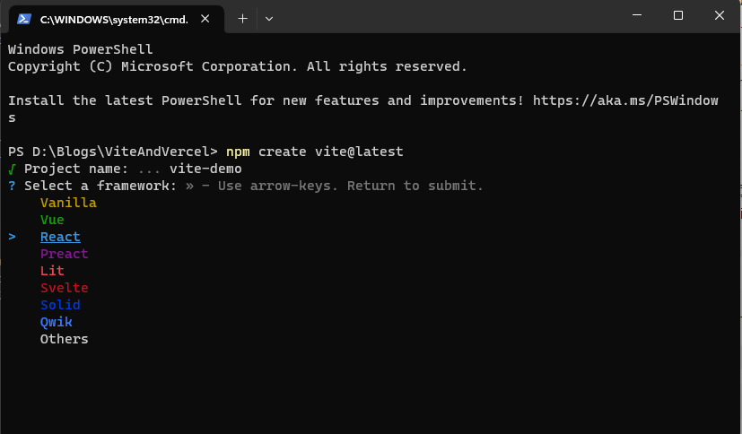
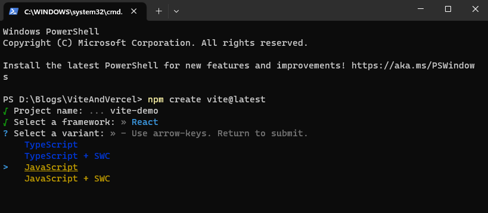
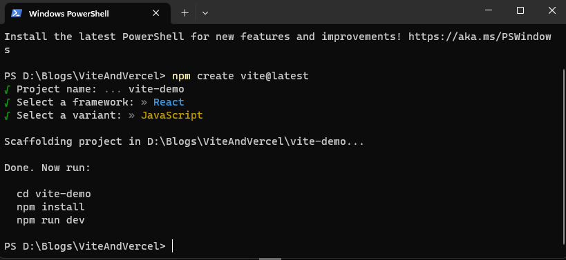
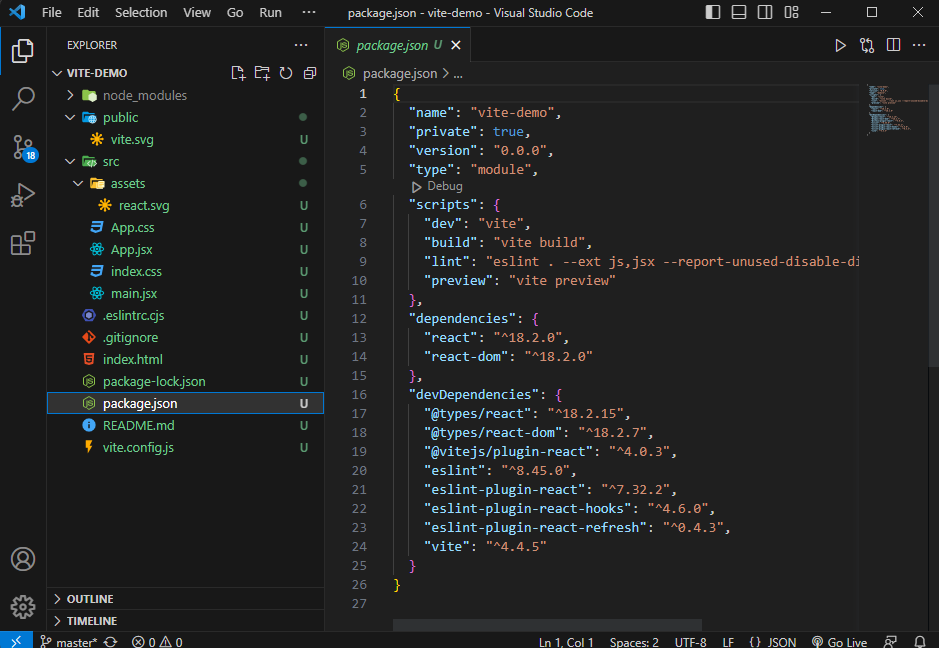
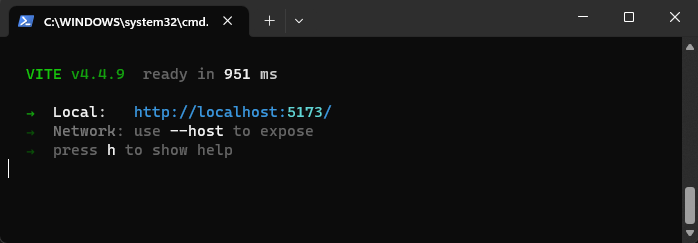
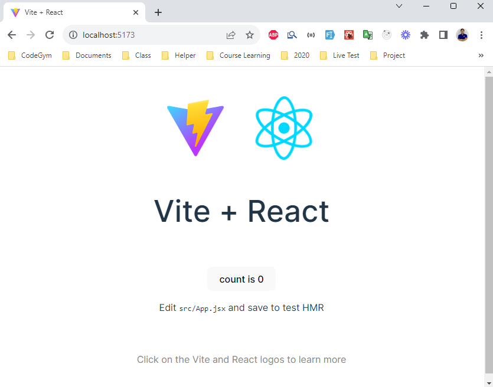
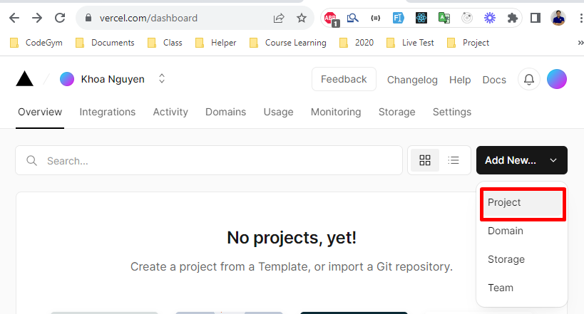

<h1>KHỞI TẠO DỰ ÁN REACT BẰNG VITE VÀ DEPLOY LÊN VERCEL</h1>

<h2>Mục lục</h2>

<ul style='list-style:none;'>
    <li style='font-style:italic;'><a href='#fn_0_1'>Mở đầu</a></li>
    <li style='font-style:italic;'><a href='#fn_0_2'>Nội dung</a>
        <ol type="1">
            <li style='font-style:italic;'><a href='#fn_1'>Vite là gì?</a></li>
            <li style='font-style:italic;'><a href='#fn_2'>Tạo dự án React với Vite</a></li>
            <li style='font-style:italic;'><a href='#fn_2'>Deploy dự án lên Vercel</a></li>
            <li style='font-style:italic;'><a href='#fn_3'>Kết luận</a></li>
        </ol>
    </li>
</ul>


<h2 id='fn_0_1'>Mở đầu</h2>

Chúng ta có nhiều cách để có thể khởi tạo một dự án React. Có bạn sẽ chọn cách tạo dự án từ một thư mục trống, sau đó tiến hành tạo các files và thư mục; rồi cài đặt các package để sử dụng. Với cách làm này chúng ta sẽ hiểu được ý nghĩa của các files và thư mục, cũng như mối quan hệ và tính cấp thiết của các files, thư mục và packages trong dự án. Nhưng nhược điểm của cách này là mất thời gian mỗi khi tạo mới dự án. Để tiết kiệm thời gian và nhanh chóng có ngay một template với các tính năng cơ bản cho dự án react, facebook đã cho ra đời package `create-react-app (CRA)`, package này sử dụng [webpack]('https://webpack.js.org/) để đóng gói và chuyển đổi code React và ES6 về JavaScript thuần. Tuy nhiên, với những dự án lớn, số lượng components nhiều thì tốc độc build của `webpack` khác lâu. Để khắc phục nhược điểm này [Even You]('https://twitter.com/youyuxi') và đồng sự đã cho ra đời `Frontend build tool` [vite.js]('https://vitejs.dev/) để giúp build các dự án React (nói riêng) nhanh hơn.

<h2 id='fn_0_2'>Nội dung</h2>

<h3 id='fn_1' class='font-weight: bolder'>1. Vite là gì?</h3>

Vite (từ tiếng Pháp có nghĩa là "nhanh", phát âm là/vit/, như "veet") là một công cụ xây dựng nhằm cung cấp giải pháp phát triển nhanh hơn và gọn gàng hơn cho các dự án web hiện đại. Về cơ bản Vite.js làm hai việc chính và thực hiện nó rất tốt:

+ Phục vụ mã cục bộ trong quá trình developemnt ứng dụng,
+ Đóng gói các tài nguyên như HTML, CSS, JavaScript,... phục vụ cho bản production.

Vite tận dụng các ES module nguyên bản trong trình duyệt. Điều này giúp tải mã nguồn của dự án ngay lập tức, bất kể các module được sử dụng có kích thước lớn như thế nào hoặc mã nguồn ứng dụng có kích thước lớn. Vite cũng có khả năng mở rộng cao thông qua API Plugin và API JavaScript.

<h3 id='fn_2' class='font-weight: bolder'>2. Tạo dự án React sử dụng Vite</h3>

Vite yêu cầu [Node.js]('https://nodejs.org/en') phiên bản 14.18+, 16+. Tuy nhiên, một số package yêu cầu phiên bản Node.js cao hơn để hoạt động. Do đó, bạn cần phải cài đặt `Node` hoặc nâng cấp phiên bản `Node` hiện tại ở máy bạn lên các version phù hợp.

Các bước thực hiện (sau khi đã cài/nâng cấp node version)

<h6>Bước 1:</h6> 

Tại thư mục máy tính của bạn thực hiện một trong các lệnh sau:
>Sử dụng npm
```nodejs
npm create vite@latest
```
>Sử dụng yarn
```nodejs
$ yarn create vite
```

<h6>Bước 2:</h6> 

Chương trình sẽ yêu cầu các bạn cung cấp một số thông tin và lựa chọn ngôn ngữ sử dụng trong dự án. Ở đây mình sẽ đặt tên dự án là `vite-demo` và chọn framework là react.



Tiếp theo các bạn sẽ chọn ngôn ngữ để sử dụng, ở đây mình sẽ chọn là `javascript`



Tiếp theo, các bạn lần lượt thực hiện các lệnh commandline sau: `cd vite-demo` đưa con trỏ hệ thống vào thư mục dự án (ở đây là vite-demo), sau đó tiến hành lệnh `npm install` để cài đặt template và các package cần thiết. Nếu các bạn muốn xem mã nguồn bằng `VS Code` thì thực hiện lênh `code .`, còn muốn chạy dự án thực hiện lệnh `npm run dev`.



Kiến trúc dự án React được tạo bởi vite như sau:



Khi thực hiện lệnh `npm run dev` thì hệ thống sẽ đề xuất một port như sau (đây là thông số của máy mình nhé)



Và đây là kết quả



<h3 id='fn_3' class='font-weight: bolder'>3. Deploy dự án lên Vercel</h3>

Một trong những việc cần phải làm trong khi (sau khi) làm xong dự án đó là tiến hành thuê host và mua tên miền. Đối với các bạn đang là sinh viên/học viên thì sẽ ưu tiên chọn những nhà cung cấp miễn phí. Chúng ta có rất nhiều sự lựa chọn chẳng hạn như deploy lên `github` hay `heroku`. Nhưng ở đây mình xin giới thiệu đến các bạn một sự lựa chọn mới đó là `vercel`.

[vercel]('https://vercel.com/) là một nền tảng đám mây được phát triển bởi Vercel Inc. (trước đây là ZEIT) và được dùng để phát triển, triển khai và quản lý các ứng dụng web và dự án frontend. Nền tảng này giúp cho các nhà phát triển web dễ dàng tạo và triển khai các ứng dụng React, Angular, Vue và nhiều công nghệ frontend khác một cách nhanh chóng và tiện lợi.

Các bước tiến hành deploy dự án lên vercal.

<h6>Bước 1:</h6> 

Nếu các bạn chưa đăng ký tài khoản ở vercel thì thực hiện như sau, nếu đã có rồi thì có thể bỏ qua bước này.
Truy cập vào [vercel]('https://vercel.com/) sau đó chọn `Sign Up`, ở đây mình sẽ `Sign Up` bằng cách sử dụng email, các bạn có thể chọn các hình thức khác như `github`, `gitlab` hay `bitbuket`.

<h6>Bước 2:</h6> 

Tiến hành deploy dự án, ở đây dự án của mình đang lưu trữ ở `github`. Nên bước tiếp theo mình sẽ chọn `Import Git Repository` là `github`.



Sau đó các bạn tiến hành xác thực tài khoản `github` của mình. sau khi xác thực xong thì các bạn tiến hành chọn dự án mà các bạn muốn deploy.
<h3 id='fn_3' class='font-weight: bolder'>3. Kết luận</h3>

Như vậy chúng ta đã tìm hiểu về định dạng/cú pháp của một số hàm trong JavaScript. Có thể các bạn đã từng sử dụng/làm việc với một trong nhưng loại hàm này, nhưng chưa xác định được tên gọi của từng loại hàm. Hy vọng qua bài viết này các bạn sẽ biết thêm về các loại hàm có trong javaScript và qua đó giúp bạn có thêm nhiều sự lựa chọn khi thiết kế các hàm trong quá trình phát triển phần mềm.